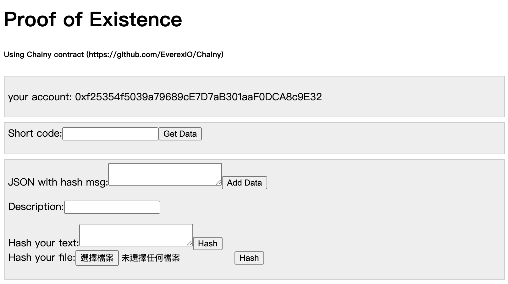
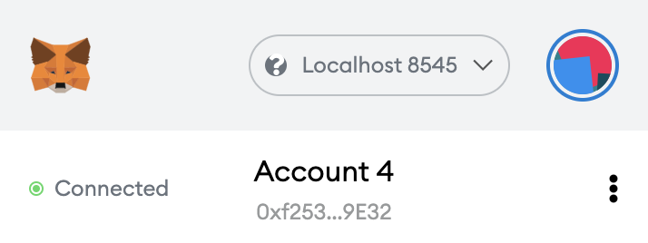

#### Dapp for proof of existence on ethereum

- school work testing
- using Chainy contract (https://github.com/EverexIO/Chainy)
- using React.js, connect with Metamask
- only test on private chain, should revise address and abi in `src/config.js` after deploy a new Chainy contract.
- slightly revised Chainy.sol, removing `checkFormat(json);` from `addChainyData` function.

